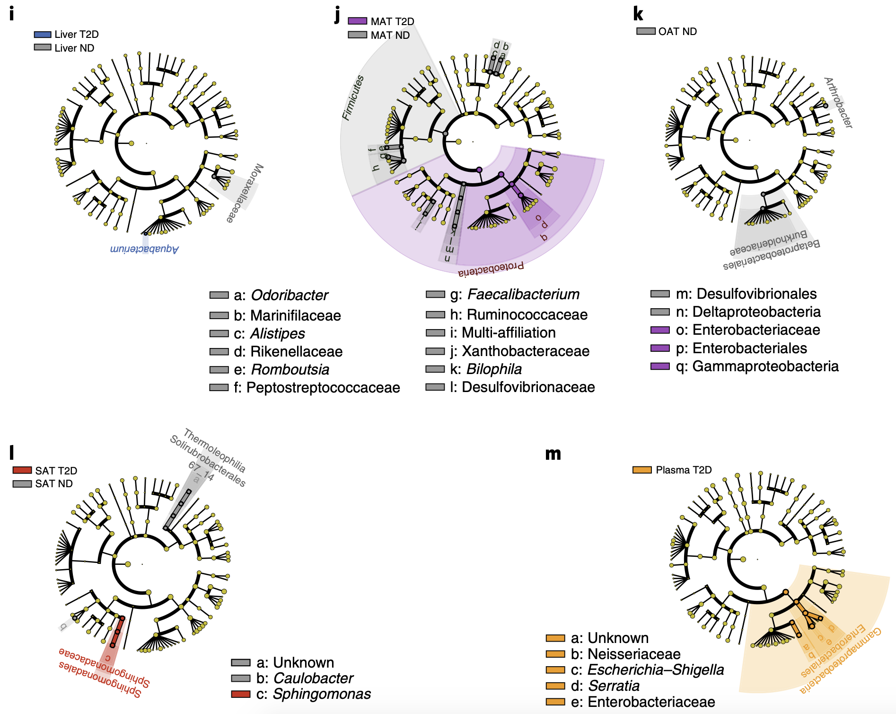
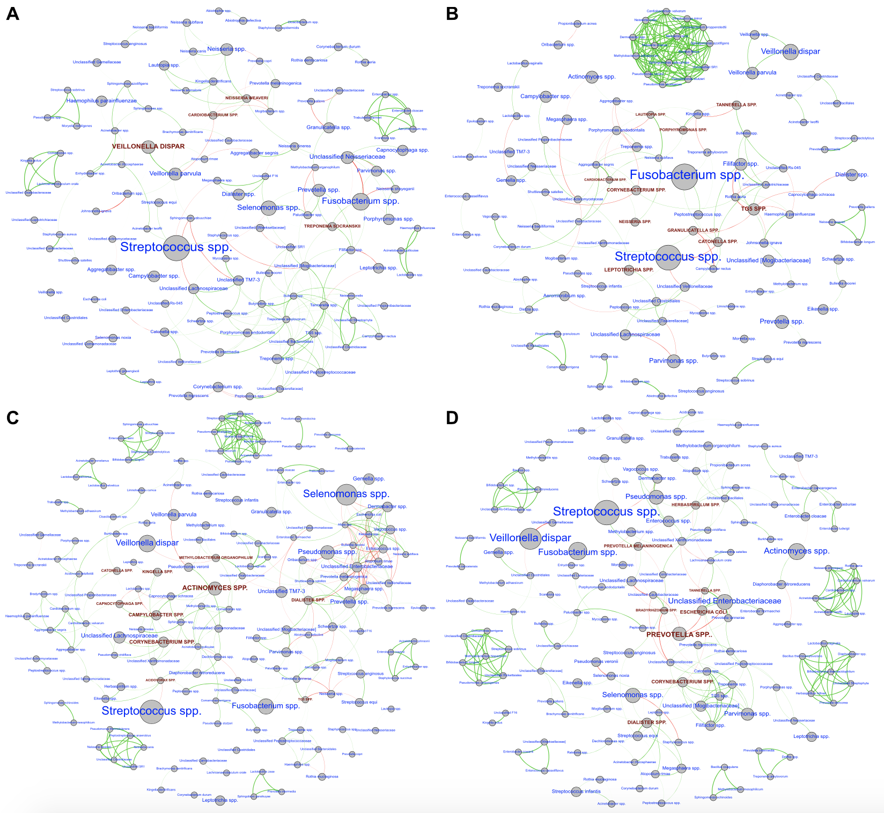
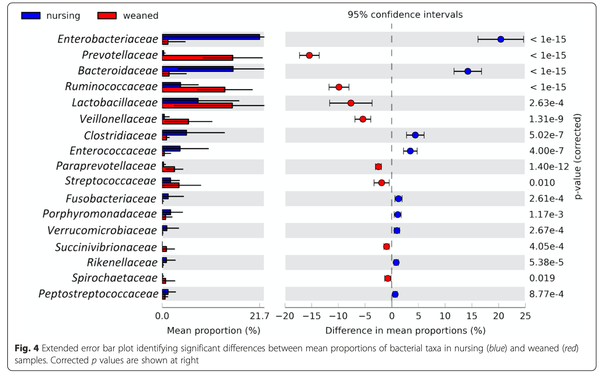
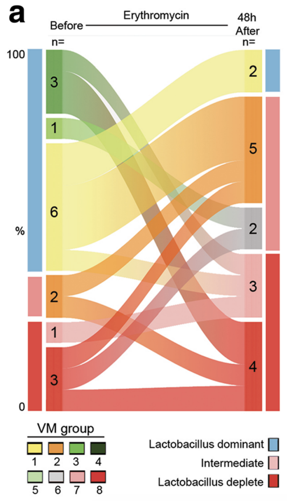
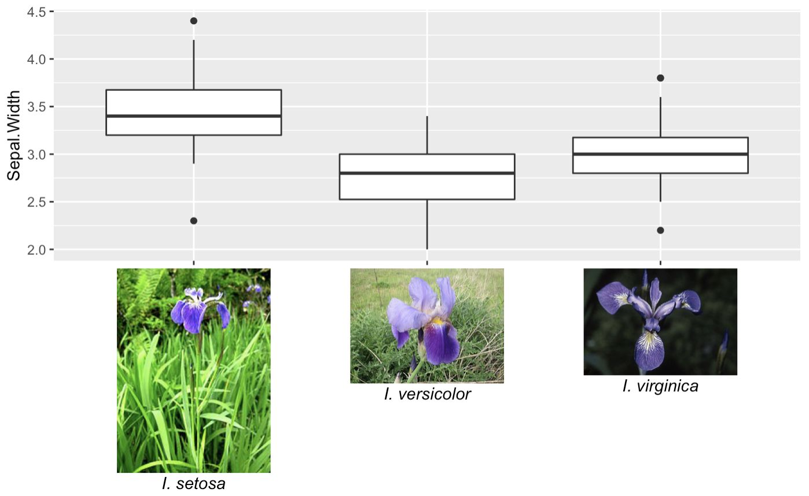

```{r setup, include=FALSE}
knitr::opts_chunk$set(echo = TRUE)
library(tidyverse)
```

# Cladogram

From https://doi.org/10.1038/s42255-020-0178-9 



\newpage

# Co-occurence network

From https://www.nature.com/articles/srep30388



\newpage

# Extended error bars

From https://microbiomejournal.biomedcentral.com/articles/10.1186/s40168-015-0091-8



\newpage

# Sankey diagram -- change of composition 

From https://bmcmedicine.biomedcentral.com/articles/10.1186/s12916-017-0999-x

{width="70%"}

\newpage

# Introduction to `ggtext`

From https://wilkelab.org/ggtext/



```{r, eval = F}
library(ggplot2)
library(ggtext)

labels <- c(
  setosa = "<br>*I. setosa*",
  virginica = "<br>*I. virginica*",
  versicolor = "<br>*I. versicolor*"
)

ggplot(iris, aes(Species, Sepal.Width)) +
  geom_boxplot() +
  scale_x_discrete(
    name = NULL,
    labels = labels
  ) +
  theme(
    axis.text.x = element_markdown(color = "black", size = 11)
  )
```


